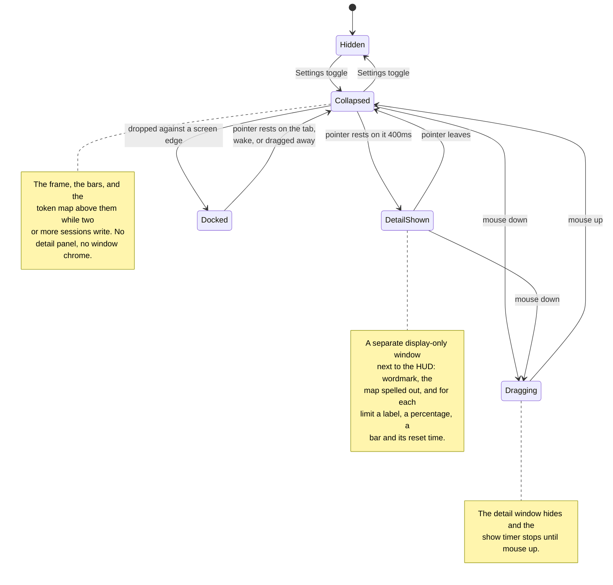

# antiburn HUD: states and positioning

_Behavior reference for the floating HUD and its platform and resource costs._

The HUD is a small always-on-top window that shows usage bars outside the menu.
The panel paints one 70% frame, white in light and black in dark, with a
vertical gradient stroke, at rest and on hover. Its native frame
follows the visible bar panel and does not change on hover. The close control
is commented out for now; the menu bar toggle hides the HUD. A
hover shows the detail in a second window, like a large tooltip.

## The states

| State            | What you see                                                | Purpose                              |
| ---------------- | ----------------------------------------------------------- | ------------------------------------ |
| **Hidden**       | Nothing                                                     | The HUD is opt-in.                   |
| **Collapsed**    | Bare LED bars, and the token map while a session writes     | It stays ambient.                    |
| **Detail shown** | The bars, plus a separate window with the spelled-out stats | It shows detail on request.          |
| **Dragging**     | The collapsed bars only                                     | It does not cover the drop position. |

### The token map

A fixed square above the bars answers "what are my agents doing right now". It
draws one blob per session that wrote tokens in the last 5 minutes. Each full
dot stands for a fixed number of tokens per minute, coloured by the mode of
work that paid for it: looking, running, changing, delegating, thinking,
talking, other. A thin frame in a per-session colour bounds each blob. Smaller
dots are sub-agents of that session. The newest turn on the map pulses.

| Map state         | What you see                                              |
| ----------------- | --------------------------------------------------------- |
| **Idle**          | No square. The bars sit alone, as before.                 |
| **One session**   | No square. The live LED carries the mode and the rate.    |
| **Many sessions** | Blobs packed busiest first, left to right, then down.     |
| **Sub-agents**    | Small dots after the parent's dots inside the same frame. |
| **Quiet session** | One dim dot, so a session that rounds to zero stays seen. |

The dot value climbs a ladder (250, 500, 1k … 500k tokens/min) until every blob
fits the square. It steps up at once and steps down only after a full window
has passed below the coarser value, so a burst does not flicker the scale. The
detail window states the current dot value.

The map shows at two or more live agents, where a sub-agent that wrote tokens
in the window counts as one. It hides at once when it drops to one, and a map that just hid waits one poll before it comes back, so a session
flickering around zero does not flash it. With one session, the usage card in
the detail window still lists that session.

The detail window follows the pointer. Over the meter it lists each session
with its rate, its top mode, and its frame colour, followed by a mode legend.
Over one agent box it shows that session alone: title, agent, rate, the mode
split as an LED row, each sub-agent on a line, and the dot value. Moving
between boxes swaps the card at once while it is open. Settings → Usage → "Show what live sessions
are doing" turns the map off. Reduced motion stops the pulse.

### Transition details

- The detail window waits for a 400ms hover intent. It hides at once when the
  pointer leaves the HUD frame.
- The close control is off. The code that puts a ✕ at the HUD's top right stays
  in place, but it is commented out. The menu bar toggle hides the HUD.
- DOM mouse edges provide the focused path. The Rust crate polls the global
  cursor every 100ms for the background path and emits `overlay_hover`.
- A mouse down clears the pending show timer and hides a visible detail window.
  The timer stays suppressed until mouse up. After mouse up, a fresh 400ms count
  starts only when the pointer still rests on the HUD.
- Dragging starts anywhere on the panel. Only mouse release or window
  blur ends the drag. The drag moves the window manually at most once per
  animation frame.
- The detail window fades in over 100ms (`--duration-quick`). It hides with no
  transition. Reduced motion disables the fade.

### Docked

Drag the HUD against any edge of its display and it docks there: the window
slides so that only a 6 logical px tab stays on screen. The renderer, the
usage poll and the token-map poll all continue, so the return is instant.
There is no setting and no dock control; the drop is the gesture.

- **Docking.** A drag that ends within 16 logical px of an edge, or past it,
  docks at that edge. A corner picks the nearer edge. The crate remembers a
  home position flush inside that edge, so a peek shows the whole HUD even
  after a drop past the edge. The slide takes 200ms. The detail window hides
  first.
- **The tab.** While docked, the crate polls the global cursor every 100ms.
  The cursor resting on the tab for 150ms peeks the HUD in to its home
  position. It parks again 3s after the pointer leaves it, or after 3s if the
  pointer never reaches it.
- **Tearing off.** A drag on a docked or peeked HUD undocks it. The HUD webview
  calls `tear_off_overlay` as the drag starts, so the auto-dock timer stops
  and the drop lands wherever the pointer leaves it. A drop near an edge docks
  again.
- **Wake.** The HUD webview asks the shell to wake a docked HUD for two
  reasons: a transcript write more than an hour after the previous one it saw
  through events, and a spend rate at the ceiling for two polls in a row. A
  woken HUD stays at least 2.8s, and longer while hovered. The burn wake re-arms
  only after the rate drops below the ceiling. Both start cold: a fresh dock
  never wakes on its first sample. Each wake is logged with its reason.
- **Displays.** The dock edge is the edge of the display the HUD was dropped
  on. An edge another display touches is not a dock edge: a drop past it
  moves the HUD back inside the display instead, so it never sits on a seam. A display change moves the HUD to its remembered placement and docks it
  again at the same edge of that display. A height change while docked keeps
  only the tab on screen. Hiding the HUD keeps it docked, so the next open
  parks it again.

### Island

On a Mac with a notch, the HUD can sit in it. The island is a pure black
panel the width of the notch plus a 30 logical px wing either side, and it
belongs to the built-in display. Drag the HUD onto the notch and drop it
there, or press "Move to Notch" on the Docking row in Settings › Usage. Drag
it out, or press the same button again, to leave. It is a third placement beside floating and edge docking, and the
crate stores it with the dock state.

- **Collapsed.** The island is the notch row alone, so the notch covers all
  of it but the wings. The left wing holds the live LED. The right wing shows
  the spend rate as a figure, or the top bar's LED when there is no rate to
  show. The detail window never opens from the collapsed row.
- **Expanded.** The crate polls the global cursor every 100ms while
  collapsed. The pointer resting for 150ms in the hotspot, the notch plus
  10px either side and 5px below, or on a wing, expands the island: the full
  HUD hangs below the notch row. It collapses 3s after the pointer leaves
  the island and the hotspot. A wake expands it the same way, for as long as
  a docked HUD peeks.
- **The detail.** On the island the detail window takes the dark theme,
  whatever the reader's own choice is, and the width of the panel the island
  draws. It hangs centred under the notch, so the card and the island read as
  one object. The reader's theme returns when the HUD leaves the notch.
- **The drag preview.** A drag that carries the HUD over the notch turns the
  floating frame into the island's shape before the drop, so the release
  says what it will do. Dragging back out restores the frame. A drop above
  the notch row, overlapping the notch, sits the HUD in the notch. A drop on a
  display without a notch docks or floats as before.
- **No notch.** A stored island placement on a Mac without a notch, such as
  an external display alone, falls back to a top dock on the HUD's display.
  When a notched display returns, the HUD goes back into the notch.
- **The window.** The island window is the notch, the wings, and a
  transparent gutter either side where the top corners curve out into the
  bezel. Its height follows the content as the floating frame's does. The
  webview draws nothing under the notch itself.

### When there are no bars

The HUD shows one empty track when it has no reading to draw. The track is the
usual width with every segment off. The HUD does not hide itself and does not
change size.

The detail window names which empty it is:

| Condition                                   | Detail window text              |
| ------------------------------------------- | ------------------------------- |
| The reader turned off every meter           | `No meter selected.`            |
| A meter is on, but no provider reported yet | `No usage limits detected yet.` |

The two are different facts. The first is a choice the reader made in
Settings → Usage → Show Meter. The second is an absence of data. The HUD must
not report a setting as a failure.

The HUD polls the usage summary every 60 seconds and also listens for the
summary the shell pushes. The push is what makes a Show Meter switch reach the
HUD at once instead of on the next poll.

## The detail window

The detail window (`antiburn-hud-detail`) is pure display. It ignores cursor
events, never takes focus, and holds no controls. Settings stays reachable
through the tray.

The first hover creates the window hidden. After that it stays warm and only
shows and hides, like the popover. The HUD session owns the data: it pushes the
derived bars with the show call and again on every usage refresh while the
window is visible. The webview measures its rendered content and reports the
height. The shell sizes, places, and shows the window in one step, so it appears
at its final size.

A hide runs through the webview as well. The webview clears the card while it
can still paint, reports back, and only then does the shell hide the window. A
short fallback handles a missing report. An empty last frame keeps the next show
clean.

### Placement

- The anchor is the content-sized HUD frame.
- The window is 176 logical pixels wide and left-aligned with the HUD. It
  prefers the space below the HUD.
- It flips above the HUD when the space below would cross the screen's bottom
  margin.
- It clamps to the monitor that holds the HUD, with an 8px margin.
- The webview's transparent padding carries the drop shadow and forms the
  visible gap to the HUD.

## Positioning

The HUD's native frame is 176 logical pixels wide and exactly as tall as the
rendered bar panel, up to a 500px safety ceiling. The default position is
centered under the primary macOS menu bar, with a 24px menu-bar allowance and an
8px gap. Reopening a live window keeps the reader's position and measured
height.

### Remembered position

The HUD returns to where the reader put it, on the display they put it on.

Each drag stores an entry under the `internal:hudPlacements` scalar: the
display's identity, and the position as a logical offset from that display's own
top-left corner. The offset is relative because a new arrangement moves the
display itself in the shared desktop space. A display's identity is its name,
size, and scale factor; two identical monitors of one model make the same
identity.

The list is ordered by recency, holds 8 displays, and the head is the preferred
display. Placement takes the first entry whose display is connected, and clamps
the offset inside that display. Nothing remembered and connected means the
default position above.

**Only a drag reorders the list.** A display that disconnects makes the HUD fall
back to the next remembered display that is connected, and that fallback writes
nothing. So the preferred display stays at the head, and reconnecting it takes
the HUD back.

A 2-second poll compares the connected displays and replaces the HUD when the
set changes. Native visibility parks the poll while the HUD is closed. The same
resolution runs when the HUD is built and when it reopens, so a display change
during an off period is also caught.

The renderer measures the panel before the native window first appears.
Turning the HUD off cancels that pending reveal, even if the measurement arrives
later. Reopening uses the completed measurement. A later bar-count or font
change resizes the visible frame from its top edge. The 140ms native animation
uses the reduced-motion preference. Drag setup first snaps to the measured
height without animation, so the pointer origin matches the frame. A visible
detail window follows each animation frame, so a bar-count change keeps the two
windows joined.

The native frame reserves no transparent expansion space. Desktop clicks
outside the visible HUD reach the application underneath it.

## Stacking and spaces

The HUD and its detail window use nonactivating `NSPanel` subclasses that cannot
become key or main windows. Hidden creation and native reveal use the same
panel conversion mechanism as the menu-bar popover, without its keyboard-focus
step. The app keeps its regular activation policy for ordinary windows.

Before each reveal, the main-thread callback resolves or converts the panel,
sets its nonactivating style, and restores its stacking and Space policy. It
then uses `orderFrontRegardless()` without activating the app. Pending hide
requests still prevent a queued reveal. Conversion failure leaves the window
hidden instead of falling back to an ordinary window.

The panels retain the existing screen-saver level (1000) and
`CanJoinAllSpaces | FullScreenAuxiliary | Stationary | IgnoresCycle` policy.
The level controls stacking; it does not establish fullscreen-Space eligibility.
Manual QA of the prior ordinary-window implementation found that level 1000
alone did not make the HUD appear over another app's fullscreen Space.

The policy requests visibility across Spaces on the HUD's remembered display,
including fullscreen Spaces. There is only one HUD, not a copy on each display,
and it does not move to another display merely because an app there enters
fullscreen. Fullscreen visibility, Space switches, and passive interaction need
live macOS validation after changes to the native window mechanism.

## Data and timing

- Each LED bar has 20 segments.
- Only the first bar blinks during a live session, and only on the HUD. The
  detail window does not blink.
- The blink period follows the spend rate: dollars per minute over the token
  map's 5 minute window, summed across every session and sub-agent. $0.05/min
  and below ticks at 3 s; $2.00/min and above strobes at 300 ms; between them
  the map is geometric, quantised to eight rungs so the animation restarts a
  few times a session, not every poll. The 300 ms cap keeps a 6 px dot under
  the flash-safety band. Fast means concerning.
- The ladder when no dollars are known: a window with no priced model uses
  the fastest allowance consumption rate in the usage payload (5 to 100
  percentage points per hour on the same rungs); with neither, the LED ticks
  at the fixed 3 s. An unpriced window never sits at the slow end on its own,
  because slow claims the machine is quiet.
- The blinking segment takes the mode colour of the session with the newest
  turn on the token map. The static segments keep the bar colour.
- Under reduced motion the LED does not blink. The detail window states the
  spend rate in words instead.
- A transcript write stays live for 90 seconds.
- The renderer reads liveness once when shown. Session and scan events push
  later changes, and one timer clears the live state at its expiry.
- The renderer polls the token map every 5 seconds over a 5 minute window. The
  shell caches parsed samples per transcript fingerprint and keeps at most one
  hour of samples per session.
- The shell memoizes session discovery for 60 seconds.
- The HUD does not sweep. It shows the blink alone, so the sweep below
  describes the popover meters and the session rows.
- Unscoped bars sweep only for positive canonical provider-route counts.
  The harness does not determine the provider: Pi's recorded `openai-codex`
  route becomes OpenAI, while Pi's `anthropic` route activates Claude.
  The shell keeps the model vendor separate. Claude through OpenRouter,
  AWS, or Azure does not activate direct Anthropic bars. Unknown or missing
  routes and anonymous harness activity activate no provider bar.
  The detail window does not sweep. The popover uses the same route counts
  for its open usage meters and closed provider ring.
- A bar that holds one model sweeps only while a working session has published
  evidence for that model on the bar's canonical provider route. The Anthropic weekly Fable limit is such a bar: a session on Opus
  leaves it still, and a session on Fable sweeps it. The shell reports the
  model and recorded provider from the same newest published modeled turn,
  and the renderer matches that model only within its canonical route.
  Until publication supplies that evidence, the session activates neither
  provider nor model-scoped bars. The ring on the closed popover bar keeps the provider rule, because
  it shows the provider's highest meter rather than one window.
- The sweep is a gleam about three segments wide that crosses the lit
  segments from the left. An unlit segment does not move. A segment takes
  two brightness levels, off and the peak, instead of a smooth ramp: the
  three segments of the band hold the peak together, and the band hops a
  segment at a time, like a lamp. The gleam peaks
  at about a quarter of full strength on the HUD, which floats over the
  reader's work, and at a bit over half in the popover, which the reader
  opened. A
  segment keeps its colour under it either way. Above a dark
  segment the gleam is the shimmer white the session list runs across a
  running session's title, because the bar colours sit too close to the
  brand tint for a 6-pixel dot to show the tint above them. Above a light
  segment it is a dark shade of the segment's own hue: the OpenAI bar takes
  the label colour, which is near white in dark mode, and white above white
  shows nothing. A bar with nothing lit flashes its first segment in the
  brand tint as the sweep passes, so a session at zero usage still shows. On
  the closed popover bar the gleam runs from twelve o'clock to the end of
  the ring's arc and fades there; a ring under an eighth flashes its first
  eighth in the brand tint.
- The cycle is 4 seconds, the cycle of the shimmer the session list runs
  across a running session's title, on the HUD and in the popover alike: a
  live session moves at one pace on every surface. The two also share a
  phase. A CSS animation starts when the browser applies it, so the
  renderer sets the start time of each live animation from the wall clock
  instead. A title shimmer and a meter sweep therefore hold the same point
  of the cycle, however late either one starts. The renderer sets the start
  time again when an animation starts, when the window comes back, and once
  each cycle, so a window that stopped painting returns in step. It sets
  the start time on an animation frame, where the animation clock and the
  wall clock agree. The stylesheets declare no delay, because a delay would
  move the phase on every render. The sweep then holds back 0.2 seconds. The shimmer's band is soft
  and almost a title wide, so it fades in, and this band is sharp and three
  segments wide, so it snaps on: equal centres look early on the meter. The band crosses the bar
  in about 2 seconds, half the cycle, and the bar rests for the remainder.
  A provider's rows run 100 milliseconds apart from the top. With no bars at
  all, the one empty bar sweeps for named working or anonymous activity, not
  quiet sessions.
- One animation drives every live meter on a surface, and each segment
  reads the sweep position from it. A CSS animation starts when the browser
  applies it, so a meter with its own animation keeps its own clock. The
  shared clock holds the rows in phase, however late a row joins.
- Under reduced motion the sweep stops, and the next segment to light holds
  the brand tint instead, which is the first segment when usage is too low
  to light one. The ring holds its next eighth.
- Liveness comes from the session lifecycle registry: the renderer
  subscribes to `session:lifecycle`, then reads the versioned
  `get_live_sessions` snapshot, and applies only deltas with a higher
  sequence. Global liveness remains true while the registry's exact `working` or
  `anonymous` count is above zero; the snapshot carries the counts and the
  last lifecycle event of each registry batch re-stamps them, so the
  snapshot's bounded rows never decide it. A session works until the
  registry says `quiet` (30 seconds without a write); anonymous agent
  activity works until the registry says `anonymous_cleared`, when a scan
  pass covers it or the same window passes. The renderer keeps no timer
  for lifecycle expiry. Quiet sessions remain active for list pills until
  180 seconds without a write, but do not blink. A new write can resume them;
  `resumed` is Activity metadata, not a fourth state. Deadline wakes include
  one second of slack; transport can add delay.
- The projection bridge relays lifecycle transitions while enriched row loads
  run separately. A resync replaces the snapshot and counts; row projection
  never decides HUD liveness. Silent startup seeds can have sequence zero.
  Unknown list identities are distinct from known presence or absence at zero.
  A truncated zero-sequence seed queries omitted interests and accepts their
  same-sequence answers once; duplicate or stale answers cannot replace newer
  evidence. Exact HUD counts remain independent of these list queries.
  V49 persists incarnations internally; V48 remains attribution data.
  See `docs/session-lifecycle-events.md` for evidence guards, permissions,
  named presence, convergence, and resource limits.
- Exact per-harness working and anonymous counts cover every canonical identity,
  independently of the snapshot row limit. Execution counts group by route and
  model within each harness. Missing routes have no model-derived fallback.
  Pending, failed, unmodeled, and anonymous evidence proves no provider or model
  sweep. Other unknown identities do not suppress a known matching model.
- The existing projection worker reads compact published models in pages of at
  most 256, outside the actor. Incarnation, metadata epoch, ticket, and writer
  revision guard each answer. Publication fences identify row provenance, not
  a version. A successful analysis observation invalidates old model evidence;
  processing or failure alone does not. Metadata changes publish sequenced
  `sweep_changed` events without changing activity timestamps.
- Explicit recovery clears positive scoped evidence until a current snapshot or
  aggregate arrives. A failed recovery cannot retain a stale model sweep.
- The renderer polls usage every 60 seconds while shown.
- The native hover watcher polls every 100ms while the window is visible.
- Hiding the HUD parks the native polls and the retained renderer's timers.
- The HUD uses the Bitcount Prop Single Variable face for captions, numbers,
  and its wordmark.

## Preference and entry points

The preference key is `antiburn.showFloatingHud` in localStorage. Settings →
Usage writes it. The popover session restores the HUD at startup when it reads
`1`. The HUD close button writes `0` before it calls the native hide command.

Each webview can hold a different localStorage copy. The native window therefore
broadcasts each visibility change. Settings uses that live state, refreshes it
when it receives focus, and updates its cached preference. The close control,
when it comes back, turns the Settings control off in the same way. The cached
value only restores the HUD at startup.

The dock state (`internal:hudDock`: docked, and the edge) lives in the shell
store. `record_hud_position` writes it after every drag, and `tear_off_overlay`
clears the docked flag. The shell applies it to the HUD on every open and at
launch, so a docked HUD comes back docked.

## Platform boundary

v1 is macOS-only. The native crate returns without creating a window on other
platforms, and the frontend hides the Settings entry point there. Windows needs tuning
for its taskbar position. Linux waits for reliable Wayland positioning and
always-on-top behavior.

## Rejected positioning designs

| Design                                      | Failure                                                  |
| ------------------------------------------- | -------------------------------------------------------- |
| Keep a fixed 500px transparent frame        | Invisible space blocks clicks in other applications.     |
| Expand the HUD panel in place               | Content shifts under the pointer and complicates drag.   |
| Make the complete window ignore mouse input | The visible HUD cannot drag or answer its close control. |
| Move the HUD to make room for detail        | The HUD leaves the position the reader chose.            |

The separate detail window and content-sized HUD frame close this list. The HUD
does not expand, and the detail window is sized before it appears.
