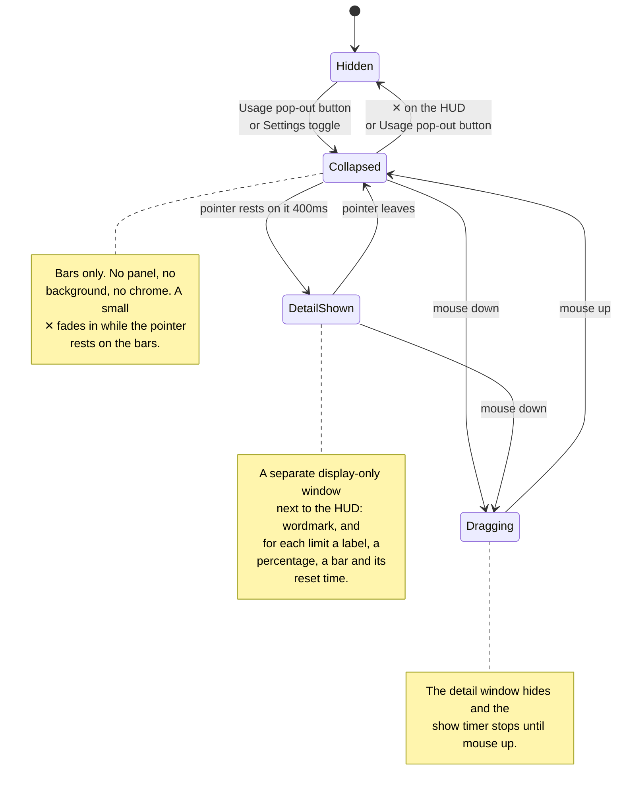

<!--
  This Source Code Form is subject to the terms of the Mozilla Public
  License, v. 2.0. If a copy of the MPL was not distributed with this
  file, You can obtain one at https://mozilla.org/MPL/2.0/.
-->

# antiburn HUD: states and positioning

_Behavior reference for the floating HUD. Source-governance D-026 authorizes
the port, and deviations-register D-30 records its platform and resource costs._

The HUD is a small always-on-top window that shows usage bars outside the menu.
The HUD window itself never changes size, layout, or position on hover. A hover
shows the detail in a second window, like a large tooltip.

## The states

| State            | What you see                                              | Purpose                                    |
| ---------------- | --------------------------------------------------------- | ------------------------------------------ |
| **Hidden**       | Nothing                                                   | The HUD is opt-in.                         |
| **Collapsed**    | Bare LED bars on a transparent background                 | It stays ambient.                          |
| **Detail shown** | The bars, plus a separate window with the spelled-out stats | It shows detail on request.              |
| **Dragging**     | The collapsed bars only                                   | It does not cover the drop position.       |

### Transition details

- The detail window waits for a 400ms hover intent. It hides at once when the
  pointer leaves the HUD panel.
- The ✕ sits at the HUD's top right. It fades in as soon as the pointer enters
  the panel and adds no height.
- DOM mouse edges provide the focused path. The Rust crate polls the global
  cursor every 100ms for the background path and emits `overlay_hover`.
- A mouse down on the panel clears the pending show timer and hides a visible
  detail window. The timer stays suppressed until mouse up. After mouse up, a
  fresh 400ms count starts only when the pointer still rests on the panel.
- Dragging starts on the panel except on the ✕. Only mouse release or window
  blur ends the drag. The drag moves the window manually at most once per
  animation frame.
- The detail window fades in over 100ms (`--duration-quick`). It hides with no
  transition. Reduced motion disables the fade.

## The detail window

The detail window (`antiburn-hud-detail`) is pure display. It ignores cursor
events, never takes focus, and holds no controls — the pointer never travels
into it. Settings stays reachable through the tray.

The first hover creates the window hidden. After that it stays warm and only
shows and hides, like the popover. The HUD session owns the data: it pushes the
derived bars with the show call and again on every usage refresh while the
window is visible. The webview measures its rendered content and reports the
height, and the shell sizes, places, and shows the window in one step — the
window appears at final size and never resizes on screen.

A hide runs through the webview as well: the webview clears the card while it
can still paint, reports back, and only then does the shell hide the window,
with a short fallback in case the report never comes. A hidden webview keeps
its last frame and macOS flashes that frame on the next show — an empty last
frame makes the next show start clean.

### Placement

- The anchor is the HUD panel's drawn rect: the window position plus the hover
  region edges the HUD already reports.
- The window is 176 logical pixels wide and left-aligned with the panel. It
  prefers the space below the panel.
- It flips above the panel when the space below would cross the screen's bottom
  margin.
- It clamps to the monitor that holds the HUD, with an 8px margin.
- The webview's transparent padding carries the drop shadow and forms the
  visible gap to the HUD.

## Positioning

The HUD's native frame is 176×500 logical pixels. The default position is
centered under the primary macOS menu bar, with a 24px menu-bar allowance and
an 8px gap. Reopening a live window keeps the reader's position. The panel
draws at the frame top; the rest of the frame is transparent.

The transparent part of the frame can swallow clicks intended for another
application. Cursor pass-through made the prototype unresponsive, so v1 accepts
this cost. Shrinking the frame to fit the bars is a planned follow-up.

## Data and timing

- Each LED bar has 20 segments.
- Only the first bar blinks during a live session, and only on the HUD — the
  detail window does not blink.
- A transcript write stays live for 90 seconds.
- The renderer polls session liveness every 5 seconds.
- The shell memoizes session discovery for 60 seconds.
- The renderer polls usage every 60 seconds.
- Reset labels update every 30 seconds.
- The native hover watcher polls every 100ms while the window is visible.
- The HUD uses the Bitcount Prop Single Variable face for captions, numbers,
  and its wordmark.

## Preference and entry points

The preference key is `antiburn.showFloatingHud` in localStorage. Settings →
Usage writes it. The Usage header pop-out button writes it. The popover session
restores the HUD at startup when it reads `1`. The HUD close button writes `0`
before it hides the window.

Each webview can hold a different localStorage copy. The pop-out button asks the
native window for current visibility when it mounts and whenever the popover
receives focus. This known drift remains part of the port.

## Platform boundary

v1 is macOS-only. The native crate returns without creating a window on other
platforms, and the frontend hides both entry points there. Windows needs tuning
for its taskbar position. Linux waits for reliable Wayland positioning and
always-on-top behavior.

## Rejected positioning designs

The HUD panel once expanded in place inside its oversized frame, and these
designs tried to keep that expansion on screen:

| Design                                      | Failure                                                  |
| ------------------------------------------- | -------------------------------------------------------- |
| Clamp the complete frame during expansion   | The large frame moves the panel hundreds of pixels.      |
| Restore a clamped position after collapse   | The panel loops between enter and leave at screen edges. |
| Never move and never flip                   | The expanded panel clips at the bottom.                  |
| Move only by the expansion shortfall        | The HUD remains in a position the reader did not choose. |
| Reserve space at rest and snap after a drop | The HUD jumps when the reader releases it.               |
| Expand in place with reserve-and-flip moves | Shipped first, then replaced: every feature had to thread through the reserve logic, and the content still shifted under the cursor. |

The separate detail window closes this list. A window sized before it shows
has no expansion to position.
