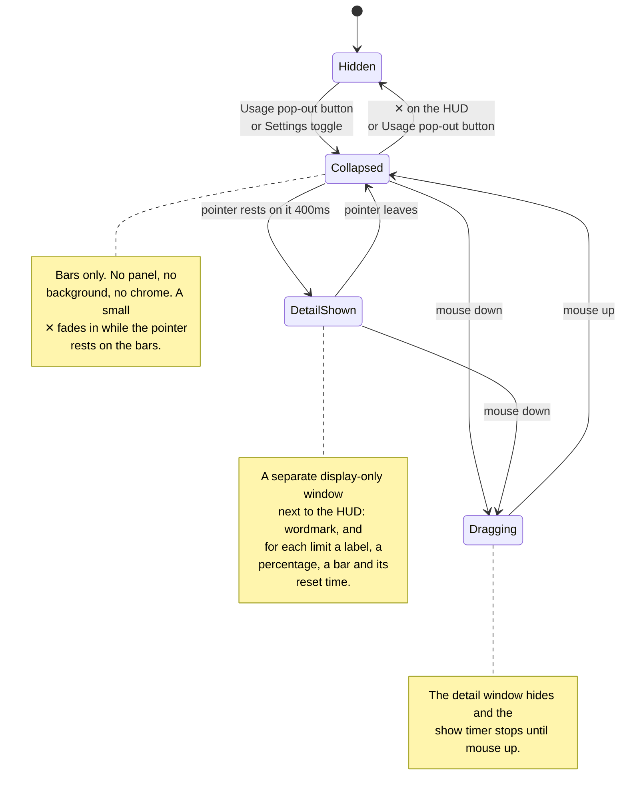

# antiburn HUD: states and positioning

_Behavior reference for the floating HUD and its platform and resource costs._

The HUD is a small always-on-top window that shows usage bars outside the menu.
Its native frame follows the visible bar panel and does not change on hover. A
hover shows the detail in a second window, like a large tooltip.

## The states

| State            | What you see                                                | Purpose                              |
| ---------------- | ----------------------------------------------------------- | ------------------------------------ |
| **Hidden**       | Nothing                                                     | The HUD is opt-in.                   |
| **Collapsed**    | Bare LED bars on a transparent background                   | It stays ambient.                    |
| **Detail shown** | The bars, plus a separate window with the spelled-out stats | It shows detail on request.          |
| **Dragging**     | The collapsed bars only                                     | It does not cover the drop position. |

### Transition details

- The detail window waits for a 400ms hover intent. It hides at once when the
  pointer leaves the HUD frame.
- The ✕ sits at the HUD's top right. It fades in as soon as the pointer enters
  the frame and adds no height.
- DOM mouse edges provide the focused path. The Rust crate polls the global
  cursor every 100ms for the background path and emits `overlay_hover`.
- A mouse down clears the pending show timer and hides a visible detail window.
  The timer stays suppressed until mouse up. After mouse up, a fresh 400ms count
  starts only when the pointer still rests on the HUD.
- Dragging starts on the panel except on the ✕. Only mouse release or window
  blur ends the drag. The drag moves the window manually at most once per
  animation frame.
- The detail window fades in over 100ms (`--duration-quick`). It hides with no
  transition. Reduced motion disables the fade.

### When there are no bars

The HUD shows one empty track when it has no reading to draw. The track is the
usual width with every segment off. The HUD does not hide itself and does not
change size.

The detail window names which empty it is:

| Condition                                   | Detail window text              |
| ------------------------------------------- | ------------------------------- |
| The reader turned off every meter            | `No meter selected.`            |
| A meter is on, but no provider reported yet  | `No usage limits detected yet.` |

The two are different facts. The first is a choice the reader made in
Settings → Usage → Show Meter. The second is an absence of data. The HUD must
not report a setting as a failure.

The HUD polls the usage summary every 60 seconds and also listens for the
summary the shell pushes. The push is what makes a Show Meter switch reach the
HUD at once instead of on the next poll.

## The detail window

The detail window (`antiburn-hud-detail`) is pure display. It ignores cursor
events, never takes focus, and holds no controls. Settings stays reachable
through the tray.

The first hover creates the window hidden. After that it stays warm and only
shows and hides, like the popover. The HUD session owns the data: it pushes the
derived bars with the show call and again on every usage refresh while the
window is visible. The webview measures its rendered content and reports the
height. The shell sizes, places, and shows the window in one step, so it appears
at its final size.

A hide runs through the webview as well. The webview clears the card while it
can still paint, reports back, and only then does the shell hide the window. A
short fallback handles a missing report. An empty last frame keeps the next show
clean.

### Placement

- The anchor is the content-sized HUD frame.
- The window is 176 logical pixels wide and left-aligned with the HUD. It
  prefers the space below the HUD.
- It flips above the HUD when the space below would cross the screen's bottom
  margin.
- It clamps to the monitor that holds the HUD, with an 8px margin.
- The webview's transparent padding carries the drop shadow and forms the
  visible gap to the HUD.

## Positioning

The HUD's native frame is 176 logical pixels wide and exactly as tall as the
rendered bar panel, up to a 500px safety ceiling. The default position is
centered under the primary macOS menu bar, with a 24px menu-bar allowance and an
8px gap. Reopening a live window keeps the reader's position and measured
height.

The renderer measures the panel before the native window first appears.
Turning the HUD off cancels that pending reveal, even if the measurement arrives
later. Reopening uses the completed measurement. A later bar-count or font
change resizes the visible frame from its top edge. The 140ms native animation
uses the reduced-motion preference. Drag setup first snaps to the measured
height without animation, so the pointer origin matches the frame. A visible
detail window follows each animation frame, so a bar-count change keeps the two
windows joined.

The native frame reserves no transparent expansion space. Desktop clicks
outside the visible HUD reach the application underneath it.

## Data and timing

- Each LED bar has 20 segments.
- Only the first bar blinks during a live session, and only on the HUD. The
  detail window does not blink.
- A transcript write stays live for 90 seconds.
- The renderer polls session liveness every 5 seconds.
- The shell memoizes session discovery for 60 seconds.
- The renderer polls usage every 60 seconds.
- Reset labels update every 30 seconds.
- The native hover watcher polls every 100ms while the window is visible.
- The HUD uses the Bitcount Prop Single Variable face for captions, numbers,
  and its wordmark.

## Preference and entry points

The preference key is `antiburn.showFloatingHud` in localStorage. Settings →
Usage writes it. The Usage header pop-out button writes it. The popover session
restores the HUD at startup when it reads `1`. The HUD close button writes `0`
before it calls the native hide command.

Each webview can hold a different localStorage copy. The native window therefore
broadcasts each visibility change. Settings and the pop-out button use that live
state, refresh it when they receive focus, and update their cached preference.
Closing the HUD with its ✕ turns both controls off. The cached value only restores
the HUD at startup.

## Platform boundary

v1 is macOS-only. The native crate returns without creating a window on other
platforms, and the frontend hides both entry points there. Windows needs tuning
for its taskbar position. Linux waits for reliable Wayland positioning and
always-on-top behavior.

## Rejected positioning designs

| Design                                      | Failure                                                  |
| ------------------------------------------- | -------------------------------------------------------- |
| Keep a fixed 500px transparent frame        | Invisible space blocks clicks in other applications.     |
| Expand the HUD panel in place               | Content shifts under the pointer and complicates drag.   |
| Make the complete window ignore mouse input | The visible HUD cannot drag or answer its close control. |
| Move the HUD to make room for detail        | The HUD leaves the position the reader chose.            |

The separate detail window and content-sized HUD frame close this list. The HUD
does not expand, and the detail window is sized before it appears.
