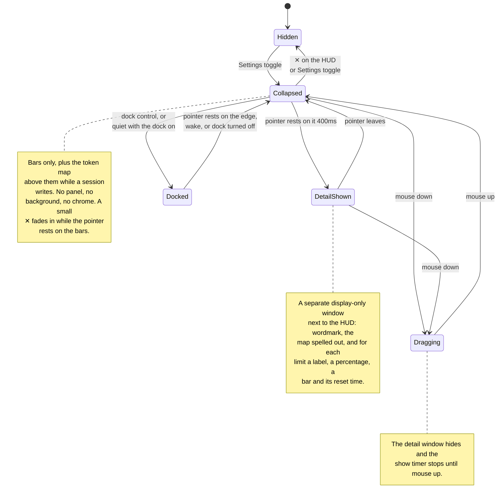

# antiburn HUD: states and positioning

_Behavior reference for the floating HUD and its platform and resource costs._

The HUD is a small always-on-top window that shows usage bars outside the menu.
The panel paints one 60% white frame with a vertical gradient stroke, at
rest and on hover. Its native frame
follows the visible bar panel and does not change on hover. The close control
is commented out for now; the menu bar toggle hides the HUD. A
hover shows the detail in a second window, like a large tooltip.

## The states

| State            | What you see                                                | Purpose                              |
| ---------------- | ----------------------------------------------------------- | ------------------------------------ |
| **Hidden**       | Nothing                                                     | The HUD is opt-in.                   |
| **Collapsed**    | Bare LED bars, and the token map while a session writes     | It stays ambient.                    |
| **Detail shown** | The bars, plus a separate window with the spelled-out stats | It shows detail on request.          |
| **Dragging**     | The collapsed bars only                                     | It does not cover the drop position. |

### The token map

A fixed square above the bars answers "what are my agents doing right now". It
draws one blob per session that wrote tokens in the last 5 minutes. Each full
dot stands for a fixed number of tokens per minute, coloured by the mode of
work that paid for it: looking, running, changing, delegating, thinking,
talking, other. A thin frame in a per-session colour bounds each blob. Smaller
dots are sub-agents of that session. The newest turn on the map pulses.

| Map state         | What you see                                              |
| ----------------- | --------------------------------------------------------- |
| **Idle**          | No square. The bars sit alone, as before.                 |
| **One session**   | No square. The live LED carries the mode and the rate.    |
| **Many sessions** | Blobs packed busiest first, left to right, then down.     |
| **Sub-agents**    | Small dots after the parent's dots inside the same frame. |
| **Quiet session** | One dim dot, so a session that rounds to zero stays seen. |

The dot value climbs a ladder (250, 500, 1k … 500k tokens/min) until every blob
fits the square. It steps up at once and steps down only after a full window
has passed below the coarser value, so a burst does not flicker the scale. The
detail window states the current dot value.

The map shows at two or more live sessions. It hides at once when it drops to
one, and a map that just hid waits one poll before it comes back, so a session
flickering around zero does not flash it. With one session, the usage card in
the detail window still lists that session.

The detail window follows the pointer. Over the meter it lists each session
with its rate, its top mode, and its frame colour, followed by a mode legend.
Over one agent box it shows that session alone: title, agent, rate, the mode
split as an LED row, each sub-agent on a line, and the dot value. Moving
between boxes swaps the card at once while it is open. Settings → Usage → "Show what live sessions
are doing" turns the map off. Reduced motion stops the pulse.

### Transition details

- The detail window waits for a 400ms hover intent. It hides at once when the
  pointer leaves the HUD frame.
- The ✕ sits at the HUD's top right. It fades in as soon as the pointer enters
  the frame and adds no height.
- DOM mouse edges provide the focused path. The Rust crate polls the global
  cursor every 100ms for the background path and emits `overlay_hover`.
- A mouse down clears the pending show timer and hides a visible detail window.
  The timer stays suppressed until mouse up. After mouse up, a fresh 400ms count
  starts only when the pointer still rests on the HUD.
- Dragging starts on the panel except on the ✕. Only mouse release or window
  blur ends the drag. The drag moves the window manually at most once per
  animation frame.
- The detail window fades in over 100ms (`--duration-quick`). It hides with no
  transition. Reduced motion disables the fade.

### Docked

With "Dock off-screen" on (Settings → Usage → Floating HUD), the HUD slides
fully off one edge of its display and keeps running there. The renderer, the
usage poll and the token-map poll all continue, so the return is instant.

- **Docking.** The dock control at the HUD's top right (visible on hover, an
  arrow pointing at the chosen edge) docks at once. Otherwise the shown HUD
  docks by itself once the pointer has been off it for 3s and any wake hold
  has passed. The slide takes 200ms. The detail window hides first.
- **Edge hit.** While docked, the crate polls the global cursor every 100ms.
  The cursor within 2 logical px of the chosen edge, inside that display, for
  150ms brings the HUD back to the position it left. It docks again 3s after
  the pointer leaves it, or after 3s if the pointer never reaches it.
- **Wake.** The HUD webview asks the shell to wake the HUD for two reasons:
  a transcript write more than an hour after the previous one it saw through
  events, and a spend rate at the ceiling for two polls in a row. A woken HUD
  stays at least 5s, and longer while hovered. The burn wake re-arms only
  after the rate drops below the ceiling. Both start cold: a fresh dock never
  wakes on its first sample. Each wake is logged with its reason.
- **Turning the dock off** brings a docked HUD home and cancels the quiet
  timer. Turning it on, or opening the HUD with it on, starts the 5s quiet
  timer, so a fresh HUD shows itself before it docks.
- **Displays.** The dock edge is the edge of the display the HUD was on. A
  display change moves the HUD to its remembered placement and docks it again
  at the same edge of that display. A height change while docked keeps the
  window off screen. Hiding the HUD forgets the dock position.

### When there are no bars

The HUD shows one empty track when it has no reading to draw. The track is the
usual width with every segment off. The HUD does not hide itself and does not
change size.

The detail window names which empty it is:

| Condition                                   | Detail window text              |
| ------------------------------------------- | ------------------------------- |
| The reader turned off every meter           | `No meter selected.`            |
| A meter is on, but no provider reported yet | `No usage limits detected yet.` |

The two are different facts. The first is a choice the reader made in
Settings → Usage → Show Meter. The second is an absence of data. The HUD must
not report a setting as a failure.

The HUD polls the usage summary every 60 seconds and also listens for the
summary the shell pushes. The push is what makes a Show Meter switch reach the
HUD at once instead of on the next poll.

## The detail window

The detail window (`antiburn-hud-detail`) is pure display. It ignores cursor
events, never takes focus, and holds no controls. Settings stays reachable
through the tray.

The first hover creates the window hidden. After that it stays warm and only
shows and hides, like the popover. The HUD session owns the data: it pushes the
derived bars with the show call and again on every usage refresh while the
window is visible. The webview measures its rendered content and reports the
height. The shell sizes, places, and shows the window in one step, so it appears
at its final size.

A hide runs through the webview as well. The webview clears the card while it
can still paint, reports back, and only then does the shell hide the window. A
short fallback handles a missing report. An empty last frame keeps the next show
clean.

### Placement

- The anchor is the content-sized HUD frame.
- The window is 176 logical pixels wide and left-aligned with the HUD. It
  prefers the space below the HUD.
- It flips above the HUD when the space below would cross the screen's bottom
  margin.
- It clamps to the monitor that holds the HUD, with an 8px margin.
- The webview's transparent padding carries the drop shadow and forms the
  visible gap to the HUD.

## Positioning

The HUD's native frame is 176 logical pixels wide and exactly as tall as the
rendered bar panel, up to a 500px safety ceiling. The default position is
centered under the primary macOS menu bar, with a 24px menu-bar allowance and an
8px gap. Reopening a live window keeps the reader's position and measured
height.

### Remembered position

The HUD returns to where the reader put it, on the display they put it on.

Each drag stores an entry under the `internal:hudPlacements` scalar: the
display's identity, and the position as a logical offset from that display's own
top-left corner. The offset is relative because a new arrangement moves the
display itself in the shared desktop space. A display's identity is its name,
size, and scale factor; two identical monitors of one model make the same
identity.

The list is ordered by recency, holds 8 displays, and the head is the preferred
display. Placement takes the first entry whose display is connected, and clamps
the offset inside that display. Nothing remembered and connected means the
default position above.

**Only a drag reorders the list.** A display that disconnects makes the HUD fall
back to the next remembered display that is connected, and that fallback writes
nothing. So the preferred display stays at the head, and reconnecting it takes
the HUD back.

A 2-second poll compares the connected displays and replaces the HUD when the
set changes. Native visibility parks the poll while the HUD is closed. The same
resolution runs when the HUD is built and when it reopens, so a display change
during an off period is also caught.

The renderer measures the panel before the native window first appears.
Turning the HUD off cancels that pending reveal, even if the measurement arrives
later. Reopening uses the completed measurement. A later bar-count or font
change resizes the visible frame from its top edge. The 140ms native animation
uses the reduced-motion preference. Drag setup first snaps to the measured
height without animation, so the pointer origin matches the frame. A visible
detail window follows each animation frame, so a bar-count change keeps the two
windows joined.

The native frame reserves no transparent expansion space. Desktop clicks
outside the visible HUD reach the application underneath it.

## Stacking and spaces

The HUD and its detail window use nonactivating `NSPanel` subclasses that cannot
become key or main windows. Hidden creation and native reveal use the same
panel conversion mechanism as the menu-bar popover, without its keyboard-focus
step. The app keeps its regular activation policy for ordinary windows.

Before each reveal, the main-thread callback resolves or converts the panel,
sets its nonactivating style, and restores its stacking and Space policy. It
then uses `orderFrontRegardless()` without activating the app. Pending hide
requests still prevent a queued reveal. Conversion failure leaves the window
hidden instead of falling back to an ordinary window.

The panels retain the existing screen-saver level (1000) and
`CanJoinAllSpaces | FullScreenAuxiliary | Stationary | IgnoresCycle` policy.
The level controls stacking; it does not establish fullscreen-Space eligibility.
Manual QA of the prior ordinary-window implementation found that level 1000
alone did not make the HUD appear over another app's fullscreen Space.

The policy requests visibility across Spaces on the HUD's remembered display,
including fullscreen Spaces. There is only one HUD, not a copy on each display,
and it does not move to another display merely because an app there enters
fullscreen. Fullscreen visibility, Space switches, and passive interaction need
live macOS validation after changes to the native window mechanism.

## Data and timing

- Each LED bar has 20 segments.
- Only the first bar blinks during a live session, and only on the HUD. The
  detail window does not blink.
- The blink period follows the spend rate: dollars per minute over the token
  map's 5 minute window, summed across every session and sub-agent. $0.05/min
  and below ticks at 3 s; $2.00/min and above strobes at 300 ms; between them
  the map is geometric, quantised to eight rungs so the animation restarts a
  few times a session, not every poll. The 300 ms cap keeps a 6 px dot under
  the flash-safety band. Fast means concerning.
- The ladder when no dollars are known: a window with no priced model uses
  the fastest allowance consumption rate in the usage payload (5 to 100
  percentage points per hour on the same rungs); with neither, the LED ticks
  at the fixed 3 s. An unpriced window never sits at the slow end on its own,
  because slow claims the machine is quiet.
- The blinking segment takes the mode colour of the session with the newest
  turn on the token map. The static segments keep the bar colour.
- Under reduced motion the LED does not blink. The detail window states the
  spend rate in words instead.
- A transcript write stays live for 90 seconds.
- The renderer reads liveness once when shown. Session and scan events push
  later changes, and one timer clears the live state at its expiry.
- The renderer polls the token map every 5 seconds over a 5 minute window. The
  shell caches parsed samples per transcript fingerprint and keeps at most one
  hour of samples per session.
- The shell memoizes session discovery for 60 seconds.
- The renderer polls usage every 60 seconds while shown.
- The native hover watcher polls every 100ms while the window is visible.
- Hiding the HUD parks the native polls and the retained renderer's timers.
- The HUD uses the Bitcount Prop Single Variable face for captions, numbers,
  and its wordmark.

## Preference and entry points

The preference key is `antiburn.showFloatingHud` in localStorage. Settings →
Usage writes it. The popover session restores the HUD at startup when it reads
`1`. The HUD close button writes `0` before it calls the native hide command.

Each webview can hold a different localStorage copy. The native window therefore
broadcasts each visibility change. Settings uses that live state, refreshes it
when it receives focus, and updates its cached preference. Closing the HUD with
its ✕ turns the Settings control off. The cached value only restores the HUD at
startup.

The dock settings (`internal:hudDock`) live in the shell store, not in
localStorage, so every webview reads the same value. Settings → Usage and the
HUD both read them with `get_hud_dock` and follow `overlay_dock_changed`.
The shell applies them to the HUD on every open and at launch.

## Platform boundary

v1 is macOS-only. The native crate returns without creating a window on other
platforms, and the frontend hides the Settings entry point there. Windows needs tuning
for its taskbar position. Linux waits for reliable Wayland positioning and
always-on-top behavior.

## Rejected positioning designs

| Design                                      | Failure                                                  |
| ------------------------------------------- | -------------------------------------------------------- |
| Keep a fixed 500px transparent frame        | Invisible space blocks clicks in other applications.     |
| Expand the HUD panel in place               | Content shifts under the pointer and complicates drag.   |
| Make the complete window ignore mouse input | The visible HUD cannot drag or answer its close control. |
| Move the HUD to make room for detail        | The HUD leaves the position the reader chose.            |

The separate detail window and content-sized HUD frame close this list. The HUD
does not expand, and the detail window is sized before it appears.
