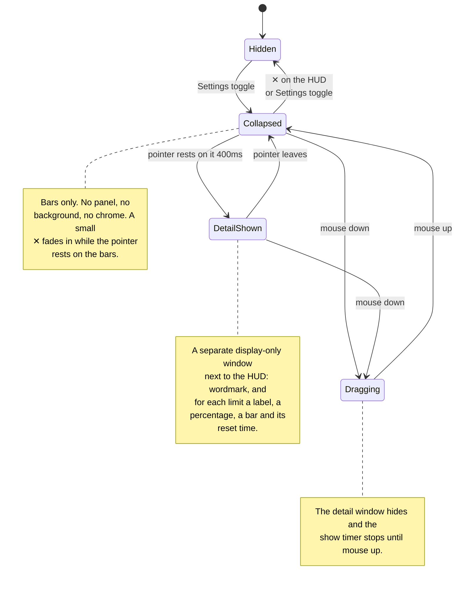

# antiburn HUD: states and positioning

_Behavior reference for the floating HUD and its platform and resource costs._

The HUD is a small always-on-top window that shows usage bars outside the menu.
Its native frame follows the visible bar panel and does not change on hover. A
hover shows the detail in a second window, like a large tooltip.

## The states

| State            | What you see                                                | Purpose                              |
| ---------------- | ----------------------------------------------------------- | ------------------------------------ |
| **Hidden**       | Nothing                                                     | The HUD is opt-in.                   |
| **Collapsed**    | Bare LED bars on a transparent background                   | It stays ambient.                    |
| **Detail shown** | The bars, plus a separate window with the spelled-out stats | It shows detail on request.          |
| **Dragging**     | The collapsed bars only                                     | It does not cover the drop position. |

### Transition details

- The detail window waits for a 400ms hover intent. It hides at once when the
  pointer leaves the HUD frame.
- The ✕ sits at the HUD's top right. It fades in as soon as the pointer enters
  the frame and adds no height.
- DOM mouse edges provide the focused path. The Rust crate polls the global
  cursor every 100ms for the background path and emits `overlay_hover`.
- A mouse down clears the pending show timer and hides a visible detail window.
  The timer stays suppressed until mouse up. After mouse up, a fresh 400ms count
  starts only when the pointer still rests on the HUD.
- Dragging starts on the panel except on the ✕. Only mouse release or window
  blur ends the drag. The drag moves the window manually at most once per
  animation frame.
- The detail window fades in over 100ms (`--duration-quick`). It hides with no
  transition. Reduced motion disables the fade.

### When there are no bars

The HUD shows one empty track when it has no reading to draw. The track is the
usual width with every segment off. The HUD does not hide itself and does not
change size.

The detail window names which empty it is:

| Condition                                   | Detail window text              |
| ------------------------------------------- | ------------------------------- |
| The reader turned off every meter           | `No meter selected.`            |
| A meter is on, but no provider reported yet | `No usage limits detected yet.` |

The two are different facts. The first is a choice the reader made in
Settings → Usage → Show Meter. The second is an absence of data. The HUD must
not report a setting as a failure.

The HUD polls the usage summary every 60 seconds and also listens for the
summary the shell pushes. The push is what makes a Show Meter switch reach the
HUD at once instead of on the next poll.

## The detail window

The detail window (`antiburn-hud-detail`) is pure display. It ignores cursor
events, never takes focus, and holds no controls. Settings stays reachable
through the tray.

The first hover creates the window hidden. After that it stays warm and only
shows and hides, like the popover. The HUD session owns the data: it pushes the
derived bars with the show call and again on every usage refresh while the
window is visible. The webview measures its rendered content and reports the
height. The shell sizes, places, and shows the window in one step, so it appears
at its final size.

A hide runs through the webview as well. The webview clears the card while it
can still paint, reports back, and only then does the shell hide the window. A
short fallback handles a missing report. An empty last frame keeps the next show
clean.

### Placement

- The anchor is the content-sized HUD frame.
- The window is 176 logical pixels wide and left-aligned with the HUD. It
  prefers the space below the HUD.
- It flips above the HUD when the space below would cross the screen's bottom
  margin.
- It clamps to the monitor that holds the HUD, with an 8px margin.
- The webview's transparent padding carries the drop shadow and forms the
  visible gap to the HUD.

## Positioning

The HUD's native frame is 176 logical pixels wide and exactly as tall as the
rendered bar panel, up to a 500px safety ceiling. The default position is
centered under the primary macOS menu bar, with a 24px menu-bar allowance and an
8px gap. Reopening a live window keeps the reader's position and measured
height.

### Remembered position

The HUD returns to where the reader put it, on the display they put it on.

Each drag stores an entry under the `internal:hudPlacements` scalar: the
display's identity, and the position as a logical offset from that display's own
top-left corner. The offset is relative because a new arrangement moves the
display itself in the shared desktop space. A display's identity is its name,
size, and scale factor; two identical monitors of one model make the same
identity.

The list is ordered by recency, holds 8 displays, and the head is the preferred
display. Placement takes the first entry whose display is connected, and clamps
the offset inside that display. Nothing remembered and connected means the
default position above.

**Only a drag reorders the list.** A display that disconnects makes the HUD fall
back to the next remembered display that is connected, and that fallback writes
nothing. So the preferred display stays at the head, and reconnecting it takes
the HUD back.

A 2-second poll compares the connected displays and replaces the HUD when the
set changes. Native visibility parks the poll while the HUD is closed. The same
resolution runs when the HUD is built and when it reopens, so a display change
during an off period is also caught.

The renderer measures the panel before the native window first appears.
Turning the HUD off cancels that pending reveal, even if the measurement arrives
later. Reopening uses the completed measurement. A later bar-count or font
change resizes the visible frame from its top edge. The 140ms native animation
uses the reduced-motion preference. Drag setup first snaps to the measured
height without animation, so the pointer origin matches the frame. A visible
detail window follows each animation frame, so a bar-count change keeps the two
windows joined.

The native frame reserves no transparent expansion space. Desktop clicks
outside the visible HUD reach the application underneath it.

## Stacking and spaces

The HUD and its detail window use nonactivating `NSPanel` subclasses that cannot
become key or main windows. Hidden creation and native reveal use the same
panel conversion mechanism as the menu-bar popover, without its keyboard-focus
step. The app keeps its regular activation policy for ordinary windows.

Before each reveal, the main-thread callback resolves or converts the panel,
sets its nonactivating style, and restores its stacking and Space policy. It
then uses `orderFrontRegardless()` without activating the app. Pending hide
requests still prevent a queued reveal. Conversion failure leaves the window
hidden instead of falling back to an ordinary window.

The panels retain the existing screen-saver level (1000) and
`CanJoinAllSpaces | FullScreenAuxiliary | Stationary | IgnoresCycle` policy.
The level controls stacking; it does not establish fullscreen-Space eligibility.
Manual QA of the prior ordinary-window implementation found that level 1000
alone did not make the HUD appear over another app's fullscreen Space.

The policy requests visibility across Spaces on the HUD's remembered display,
including fullscreen Spaces. There is only one HUD, not a copy on each display,
and it does not move to another display merely because an app there enters
fullscreen. Fullscreen visibility, Space switches, and passive interaction need
live macOS validation after changes to the native window mechanism.

## Data and timing

- Each LED bar has 20 segments.
- Every bar of a provider a live session draws on sweeps: a live Claude Code
  session sweeps each Anthropic bar. The renderer maps the agent to its
  provider (Claude Code to Anthropic, Codex to OpenAI, Antigravity to
  Google); a live agent with no provider on screen sweeps nothing. The
  detail window does not sweep. The popover sweeps the same providers from
  the same events: every usage meter of the provider on the open bar, and
  its ring on the closed bar.
- A bar that holds one model sweeps only while a live session runs that
  model. The Anthropic weekly Fable limit is such a bar: a session on Opus
  leaves it still, and a session on Fable sweeps it. The shell reports the
  model of each live session's newest analyzed turn, and the renderer
  matches that model against the bar's model name. A session reports no
  model until an analysis pass publishes its first turn, so a new session
  sweeps the unscoped bars of its provider one pass before its model-scoped
  bar. The ring on the closed popover bar keeps the provider rule, because
  it shows the provider's highest meter rather than one window.
- The sweep is a gleam about three segments wide that crosses the lit
  segments from the left. An unlit segment does not move. A segment takes
  two brightness levels, off and the peak, instead of a smooth ramp: the
  three segments of the band hold the peak together, and the band hops a
  segment at a time, like a lamp. The gleam peaks
  at about a quarter of full strength on the HUD, which floats over the
  reader's work, and at a bit over half in the popover, which the reader
  opened. A
  segment keeps its colour under it either way. Above a dark
  segment the gleam is the shimmer white the session list runs across a
  running session's title, because the bar colours sit too close to the
  brand tint for a 6-pixel dot to show the tint above them. Above a light
  segment it is a dark shade of the segment's own hue: the OpenAI bar takes
  the label colour, which is near white in dark mode, and white above white
  shows nothing. A bar with nothing lit flashes its first segment in the
  brand tint as the sweep passes, so a session at zero usage still shows. On
  the closed popover bar the gleam runs from twelve o'clock to the end of
  the ring's arc and fades there; a ring under an eighth flashes its first
  eighth in the brand tint.
- The cycle is 4 seconds, the cycle of the shimmer the session list runs
  across a running session's title, on the HUD and in the popover alike: a
  live session moves at one pace on every surface. The two also share a
  phase. A CSS animation starts when the browser applies it, so the
  renderer sets the start time of each live animation from the wall clock
  instead. A title shimmer and a meter sweep therefore hold the same point
  of the cycle, however late either one starts. The renderer sets the start
  time again when an animation starts, when the window comes back, and once
  each cycle, so a window that stopped painting returns in step. It sets
  the start time on an animation frame, where the animation clock and the
  wall clock agree. The stylesheets declare no delay, because a delay would
  move the phase on every render. The sweep then holds back 0.2 seconds. The shimmer's band is soft
  and almost a title wide, so it fades in, and this band is sharp and three
  segments wide, so it snaps on: equal centres look early on the meter. The band crosses the bar
  in about 2 seconds, half the cycle, and the bar rests for the remainder.
  A provider's rows run 100 milliseconds apart from the top. With no bars at
  all, the one empty bar sweeps for any live session.
- One animation drives every live meter on a surface, and each segment
  reads the sweep position from it. A CSS animation starts when the browser
  applies it, so a meter with its own animation keeps its own clock. The
  shared clock holds the rows in phase, however late a row joins.
- Under reduced motion the sweep stops, and the next segment to light holds
  the brand tint instead, which is the first segment when usage is too low
  to light one. The ring holds its next eighth.
- A session sweeps for 30 seconds after its last transcript write. The
  shell's lifecycle bus publishes `quiet` at that point, and the renderer
  keeps the same 30-second clock for a snapshot or a missed event. The
  session stays active for 180 seconds, the window the session list uses;
  the bus publishes `idle` then.
- The renderer reads the live set once when shown and again after each scan
  pass. `session:lifecycle` events push activity, quiet, and idle changes in
  between, about 1.5 seconds after a write lands on disk. A write under an
  agent root the store has not indexed yet counts as live for the same 30
  seconds on a local timer. A write the Claude desktop app makes to its
  session manifest schedules a rediscovery and counts as nothing.
- The renderer polls usage every 60 seconds while shown.
- The native hover watcher polls every 100ms while the window is visible.
- Hiding the HUD parks the native polls and the retained renderer's timers.
- The HUD uses the Bitcount Prop Single Variable face for captions, numbers,
  and its wordmark.

## Preference and entry points

The preference key is `antiburn.showFloatingHud` in localStorage. Settings →
Usage writes it. The popover session restores the HUD at startup when it reads
`1`. The HUD close button writes `0` before it calls the native hide command.

Each webview can hold a different localStorage copy. The native window therefore
broadcasts each visibility change. Settings uses that live state, refreshes it
when it receives focus, and updates its cached preference. Closing the HUD with
its ✕ turns the Settings control off. The cached value only restores the HUD at
startup.

## Platform boundary

v1 is macOS-only. The native crate returns without creating a window on other
platforms, and the frontend hides the Settings entry point there. Windows needs tuning
for its taskbar position. Linux waits for reliable Wayland positioning and
always-on-top behavior.

## Rejected positioning designs

| Design                                      | Failure                                                  |
| ------------------------------------------- | -------------------------------------------------------- |
| Keep a fixed 500px transparent frame        | Invisible space blocks clicks in other applications.     |
| Expand the HUD panel in place               | Content shifts under the pointer and complicates drag.   |
| Make the complete window ignore mouse input | The visible HUD cannot drag or answer its close control. |
| Move the HUD to make room for detail        | The HUD leaves the position the reader chose.            |

The separate detail window and content-sized HUD frame close this list. The HUD
does not expand, and the detail window is sized before it appears.
