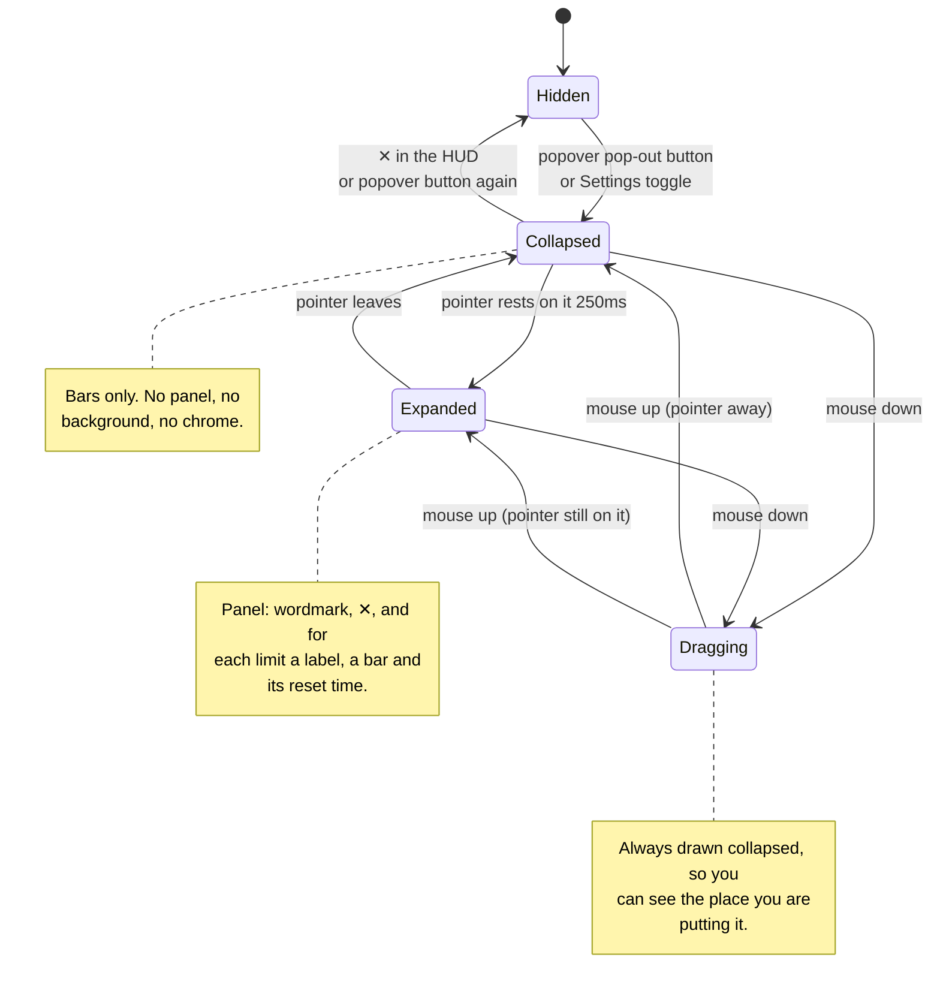

<!--
  This Source Code Form is subject to the terms of the Mozilla Public
  License, v. 2.0. If a copy of the MPL was not distributed with this
  file, You can obtain one at https://mozilla.org/MPL/2.0/.
-->

# antiburn HUD: states and positioning

_Behaviour reference for the floating HUD (`apps/desktop/src/views/OverlayWindow.tsx`). Ported with the HUD under the `hud-window-mechanics` allowlist rule (docs/oss/source-allowlist.toml, D-026); the port plan is `docs/plans/floating-hud-port.md`._

The HUD is a small always-on-top window that shows the usage bars outside the
menu. It has three visible states and one rule that turned out to matter more
than any of them: **hovering the HUD must never move it.**

## The states

### What each state is for

| State         | What you see                                     | Why                                                                   |
| ------------- | ------------------------------------------------ | --------------------------------------------------------------------- |
| **Hidden**    | Nothing                                          | The HUD is opt-in; the popover still shows the same limits.           |
| **Collapsed** | Bare LED bars on a transparent background        | Ambient. It should read as part of the desktop, not as a window.      |
| **Expanded**  | A panel with labels, percentages and reset times | The detail you only want when you ask for it.                         |
| **Dragging**  | Collapsed, regardless of hover                   | An expanded panel covers the thing you are trying to line it up with. |

### Transition details

- **Collapsed → Expanded** waits 250ms (`HOVER_INTENT_MS`). Passing the cursor
  over the HUD on the way somewhere else should not open it. Closing is
  immediate.
- Hover comes from two places: normal mouse events while the app has focus, and
  a Rust cursor watcher polling every 100ms for when it does not. macOS does not
  deliver hover to a background app, and the HUD has to work while you are in
  another app.
- **Dragging** starts on mouse down anywhere on the panel except the wordmark
  and the ✕, and ends **only** on mouse release. Anything else read as the
  drop and made the panel flap open and shut the whole way across the screen.
- The drag moves the window by hand, one step per frame, rather than handing
  off to macOS — so the window's position and the panel's inset can change
  together (see below).

## Positioning

Two requirements pull against each other:

1. The expanded panel must be fully on screen, wherever the HUD sits.
2. The HUD must be exactly where you left it. Hovering, un-hovering and
   dropping it must not shift it.

The current answer: **the window never moves on its own. The panel opens in
whichever direction has room.**

The window frame is much bigger than anything drawn in it — 176 × 500 — so
the panel has room to grow inside it either way. A HUD parked too low to open
downward is inset 220px from the frame top, and opens upward into that space
instead, the way a menu flips near the bottom of the screen.

That inset cannot be permanent. macOS will not place a window's top edge above
the menu bar, whether you drag it there or set the position in code, so a
frame that always reached 220px above the panel put a floor under the HUD
220px below the top of the screen — you simply could not drag it any higher.
So the inset is zero everywhere except low on the screen, and every change to
it is paired with an equal, opposite move of the window: the panel does not
shift, only the empty space around it. The swap happens while the HUD is at
rest, and at the start of a drag (dragging always carries a flush frame), and
the panel is hidden for the frame it takes so the change is not seen.

| When                        | What happens                                           |
| --------------------------- | ------------------------------------------------------ |
| You drop it after a drag    | The panel stays exactly where you let go.              |
| You hover it                | The panel opens, down or up. Nothing moves.            |
| You move the pointer off it | Nothing moves.                                         |
| A new limit appears         | The open direction is re-decided; the panel stays put. |

The direction is worked out while the HUD is at rest — after a drag, and when
the number of limits changes — so hovering never has to wait on a measurement.
It uses the real measured panel height once the HUD has been opened at least
once, and before that an estimate of roughly 50px per limit plus 48px of
chrome.

Known cost: the frame is a window, so its transparent area swallows clicks
meant for whatever is behind it — a patch roughly 176 × 500 around the HUD.
The frame was always bigger than the panel, so this is not new, but it is
bigger now. Handing the cursor back to the desktop outside the panel
(`set_ignore_cursor_events`) was tried and left the HUD completely
unresponsive, so it is reverted for now.

## Things tried and rejected

| Approach                                              | Why it failed                                                                                                                                              |
| ----------------------------------------------------- | ---------------------------------------------------------------------------------------------------------------------------------------------------------- |
| Clamp the whole window frame on screen at expand time | The frame is far taller than the panel, so hovering a low-parked HUD threw it hundreds of pixels up the screen.                                            |
| Clamp on expand, restore the old position on collapse | The nudge moved the window out from under the pointer, which reads as a leave, which restores it back under the pointer — an endless loop at screen edges. |
| Never move it, never flip                             | Honest, and the panel was then clipped at the bottom of the screen.                                                                                        |
| Move by the shortfall on expand only, never restore   | Fixed the clipping, but the HUD was left in a new place once the pointer moved off.                                                                        |
| Reserve room at rest, snapping on drop                | Moved the surprise to the moment of release: dropping into a corner always bounced the HUD somewhere else.                                                 |

Every one of them moved the window. That was the wrong lever; the panel is the
thing that should give way.
